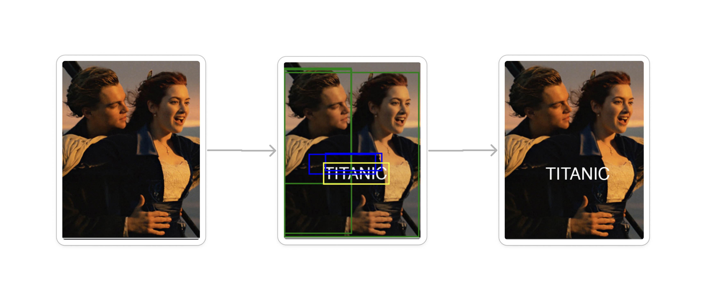

# 🎬 Poster Generator

영화 동영상과 영화 정보 파일을 활용하여 OTT 서비스에 적합한 영화 포스터(썸네일)을 생성합니다. 

한두명의 인물과 제목을 적절히 배치하고 여러 후처리를 거쳐 제작됩니다. 

생성된 포스터는 OTT서비스에서 시각적으로 매력적인 썸네일로 활용될 수 있고, 유튜브 같은 동영상 콘텐츠에도 활용할 수 있습니다.

## 📆 프로젝트 기간
- **개발:** 2024.8 - 2024.11

## 👨‍💻 역할
- 1인 개발 (인공지능 예측 모델 개발)

## 🛠️ 사용 기술
- **데이터 처리 및 분석**: NumPy, Pandas
- **파일 관리 및 이미지 처리**: OS, OpenCV, Pillow (PIL)
- **AI 및 OCR**: Ultralytics YOLO, EasyOCR, Google Generative AI
- **로깅 및 웹 요청**: Logging, Requests
- **모델 저장 및 시각화**: Joblib, Matplotlib
- **기계 학습**: Scikit-learn
- **IPython 표시**: IPython Display

## 📌 실행 방법
반드시 아래 폴더별 설명을 보며 번호 순서대로 코드를 실행합니다.

## 🚀 폴더별 설명
- **1. poster_loader**:포스터를 다운받는다.(학습용 포스터는 개별 다운 필요!!) poster_loader.ipynb파일 실행 시 poster_urls.csv에 입력된 포스터 링크에서 포스터를 다운받아 downloaded_posters폴더에 저장

- **2. poster_labeling**: 포스터에서 인물과 텍스트를 인식해 라벨링한다. poster_labeling.ipynb파일 실행 시 downloaded_posters 폴더에 있는 포스터의 인물과 텍스트의 좌표를 labeled_posters.csv에 저장한다.

- **3. train_poster_model**: 인물의 좌표를 입력하면 텍스트 좌표를 출력하는 모델 생성. train_poster_model.ipynb파일 실행 시 모델을 학습시켜 text_locator.pkl모델 파일 생성

- **4. poster_frame_selector**: 동영상 파일에서 포스터용 프레임을 선택한다. movie.mp4 동영상 파일에서 일정 간격으로 프레임을 선택한 후, 인물이 가장 잘 나온 프레임 5개를 선택하여 character_frames 폴더에 저장한다. 그 후, 선택된 5개의 프레임 앞뒤 프레임을 분석하여 가장 선명하게 나온 프레임을 선택하여 selected_frames 폴더에 저장한다.

- **5. text_positioning**: 학습한 모델로 텍스트 위치를 설정한다. movie_data.csv파일의 ‘제목 (영문)’항목을 가져와 train_poster_model/text_locator.pkl 모델을 활용하여 텍스트를 배치한 후 frames_with_text폴더에 저장한다

- **실시간 채팅**: 이전에는 React 버전에서 WebSocket, Express, MongoDB를 활용하여 실시간 채팅 기능을 구현하였습니다. 하지만 서버리스인 Next.js와 실시간 연결인 WebSocket은 구조적으로 맞지 않고, 직접적으로 사용할 수 있는 방법도 없습니다. 우회적으로 구현하는 방법은 WebSocket용 서버를 따로 사용하는 것이지만, 이러면 Next.js를 사용하는 의미가 희석됩니다. 이러한 문제를 해결하기 위해서는 서드파티 서비스를 이용하는것이 좋다고 생각합니다. 저는 실시간 채팅 부분을 클라이언트에서 렌더링 하고,  Firebase의 database와 통신하게 하여 문제를 해결하였습다. 이렇게 하면 Next.js의 서버사이드 렌더링의 장점을 활용하면서 실시간 채팅 기능을 구현할 수 있습니다.

## 📌개선할 점
1. 인물 여러명의 위치를 학습시켜 한개의 텍스트 위치 반환하도록 모델 수정
2. 여러가지 비율의 포스터를 학습시켜 다양성 확대
3. 추가 효과 기능 개발(ex. 필터, 폰트)